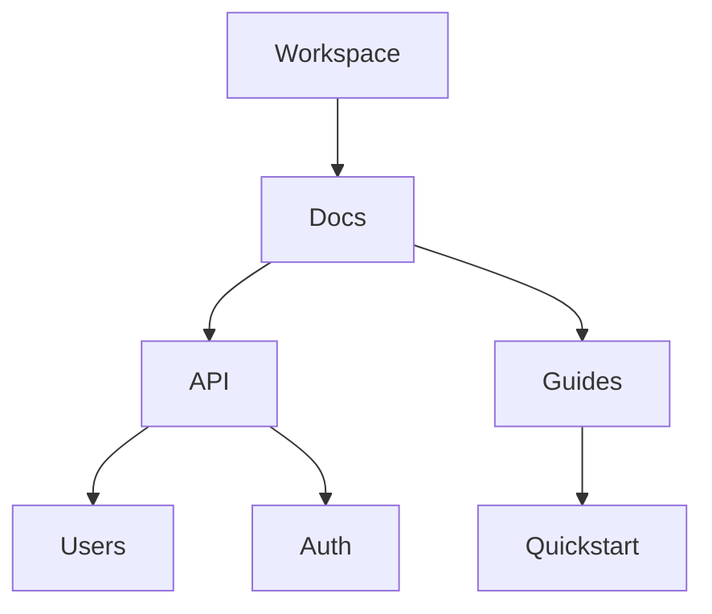

## Overview

S1Vo provides powerful tools to create, organize, collaborate on, and search your project documentation. You streamline workflows with intuitive document editing, hierarchical folder structures, real-time collaboration, and advanced search features. These core capabilities ensure your docs stay current and accessible.

<Columns cols={2}>
  <Card title="Document Creation" icon="edit-3" href="#document-creation">
    Build rich markdown documents with live previews.
  </Card>
  <Card title="Organization" icon="folder" href="#organization">
    Structure content with nested folders and pages.
  </Card>
  <Card title="Collaboration" icon="users" href="#collaboration">
    Share and co-edit docs securely with teams.
  </Card>
  <Card title="Search" icon="search" href="#search">
    Find content quickly with filters and full-text search.
  </Card>
</Columns>

## Document Creation and Editing

You create new documents directly from the dashboard or within folders. S1Vo supports markdown with live preview, syntax highlighting, and embeds for images or code.

<Steps>
  <Step title="Create Document" icon="plus">
    Click the `New Document` button. Enter a title like "API Reference".
  </Step>
  <Step title="Edit Content" icon="edit">
    Use markdown syntax. Add headings, lists, and code blocks.
  </Step>
  <Step title="Preview and Publish" icon="eye">
    Toggle preview mode. Save and publish to make it live.
  </Step>
</Steps>

```markdown
# API Endpoint

## Usage

```javascript
const response = await fetch('https://api.example.com/v1/users');
const users = await response.json();
```
```

<Callout kind="tip">
  Enable version history during editing to track changes automatically.
</Callout>

## Folder and Page Organization

Organize docs hierarchically with folders and sub-pages. You nest content to match project structures, like `/docs/api/reference/endpoints`.



| Structure | Description | Example Path |
|-----------|-------------|--------------|
| Workspace | Root level | `/workspace` |
| Folder | Group pages | `/docs/api` |
| Page | Individual doc | `/docs/api/users.mdx` |

## Collaboration and Sharing Options

Invite team members or generate share links. Control access with roles like viewer or editor.

<Tabs>
  <Tab title="Share Link" icon="link">
    Generate a public or password-protected link.
    
    ```
    https://docs.example.com/project/share/abc123
    ```
    
    Set expiration or view limits.
  </Tab>
  <Tab title="Invite Users" icon="user-plus">
    Add emails with permissions.
    
````javascript
// Example invite API (if integrated)
const invite = await fetch('https://api.example.com/v1/invites', {
  method: 'POST',
  body: JSON.stringify({
    email: 'team@company.com',
    role: 'editor'
  })
});
````
  </Tab>
</Tabs>

## Search and Filtering Capabilities

Use full-text search across all docs. Filter by folder, tags, or date modified.

<Expandable title="Advanced Filters" default-open="true">
  Combine filters like `folder:api AND tag:endpoint` for precise results.
  
  <CodeGroup tabs="Query Examples">
  ```text
  api endpoint
  ```
  ```text
  from:team@company.com modified:>2024-01-01
  ```
  </CodeGroup>
</Expandable>

<Callout kind="info">
  Index new docs automatically for instant search availability.
</Callout>

These features integrate seamlessly, letting you manage comprehensive documentation efficiently.