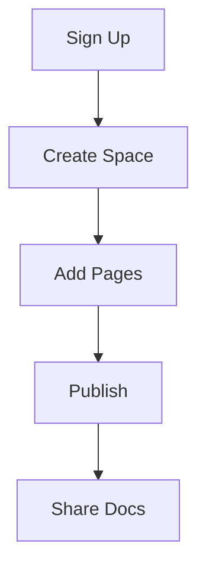

## Prerequisites

Before starting, ensure you have:

<Callout kind="info">

- A modern web browser like Chrome, Firefox, or Safari
- An email address for account verification
- No prior setup required—S1Vo handles everything in the browser

</Callout>

## Sign Up and Log In

Follow these steps to create your S1Vo account and access the dashboard.

<Steps>
  <Step title="Visit the Dashboard" icon="monitor">
    Open your browser and navigate to `https://dashboard.example.com`.
  </Step>
  <Step title="Create Account" icon="user-plus">
    Click **Sign Up**, enter your email and password, then submit the form.
  </Step>
  <Step title="Verify Email" icon="mail">
    Check your inbox for the verification link from S1Vo and click it to activate your account.
  </Step>
  <Step title="Log In" icon="log-in">
    Return to the dashboard, enter your credentials, and click **Log In**.
  </Step>
</Steps>

<Callout kind="tip">
  Save your password securely. You can enable two-factor authentication later in settings.
</Callout>

## Create Your First Documentation Space

A documentation space organizes your project's docs. Create one now.

<Steps>
  <Step title="Select New Space" icon="plus">
    In the dashboard, click **New Space** in the top-right corner.
  </Step>
  <Step title="Name Your Space" icon="edit-3">
    Enter a name like `My Project Docs` and select a template (e.g., "Default").
  </Step>
  <Step title="Customize Settings" icon="settings">
    Choose your brand color (`#3B82F6`) and add a description: "Welcome to S1Vo's documentation."
  </Step>
  <Step title="Create Space" icon="check-circle">
    Click **Create**. Your space opens with a welcome page.
  </Step>
</Steps>

## Add and Structure Initial Documents

Populate your space with content. Use the editor to add pages.

<Tabs>
  <Tab title="Add Page" icon="file-plus">
    <Steps>
      <Step title="New Page">
        Click **New Page** > **Blank Page**, name it `introduction.mdx`.
      </Step>
      <Step title="Edit Content">
        Paste initial MDX:
      </Step>
    </Steps>
  </Tab>
  <Tab title="Structure Navigation" icon="menu">
    Drag pages in the sidebar to reorder. Create folders by nesting pages.
  </Tab>
</Tabs>

<CodeGroup tabs="MDX,Markdown">
````mdx
---
title: Introduction
description: Welcome to your docs.
---
## Overview

Start here.
````
````markdown
# Introduction

Welcome to your docs.
````
</CodeGroup>

## Basic Interface Tour

Explore the main UI elements:

<Columns cols={3}>
  <Card title="Editor" icon="edit-3" href="#editor">
    Write MDX with live preview. Supports components like `<Callout>`.
  </Card>
  <Card title="Sidebar" icon="sidebar" href="#sidebar">
    Manage pages, navigation, and settings.
  </Card>
  <Card title="Preview" icon="eye" href="#preview">
    Real-time rendering of your docs.
  </Card>
</Columns>

## Next Steps

<Callout kind="success">
  Congratulations! You've created your first S1Vo space. Publish it via **Share > Publish** to get a live URL.
</Callout>

Dive deeper:

<Columns cols={2}>
  <Card title="Authentication" icon="shield" href="/authentication">
    Secure your space with API keys.
  </Card>
  <Card title="Advanced MDX" icon="code" href="/introduction">
    Learn components and best practices.
  </Card>
</Columns>

